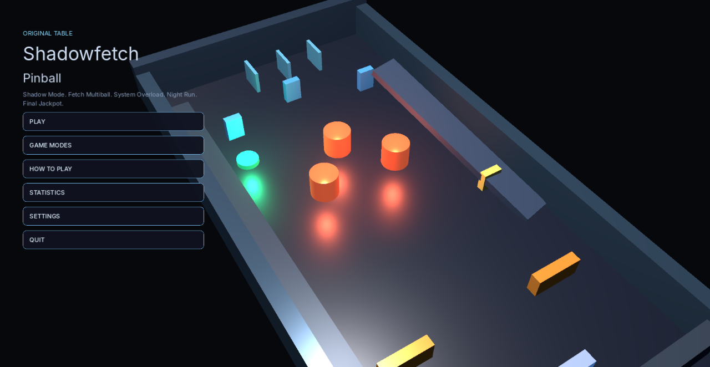
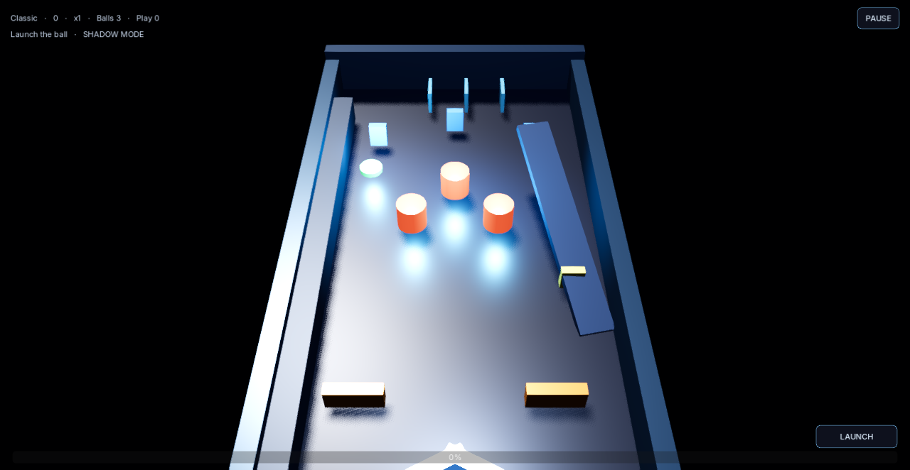

# Shadowfetch Pinball

An original Shadowfetch table for Linux. Five missions, lock, multiball, and a jackpot. Sibling machine — cyan steel, not a clone and not a copy of a commercial cabinet.





## Run

```bash
shadowfetch-pinball
```

## Tests

```bash
./tools/run_tests.sh
```

Every scoring event, mission chain, drain-once, stuck recovery, 12,000 event streams, and 8,000 simulated trajectories.

## Export and install

```bash
./tools/export_linux.sh
./tools/install_linux.sh
```

If `rsvg-convert` is missing: `sudo apt install librsvg2-bin desktop-file-utils`

## Controls

- Left / right arrows or mouse buttons for flippers
- Hold Space or click to charge the plunger
- Esc pauses

## Assets

Inter fonts — SIL OFL 1.1. Table, lights, icon, and audio are original.

No telemetry. Fictional scores only.
